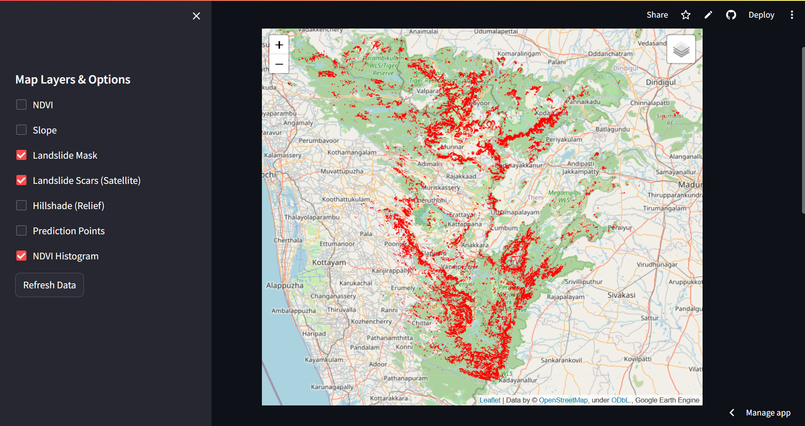
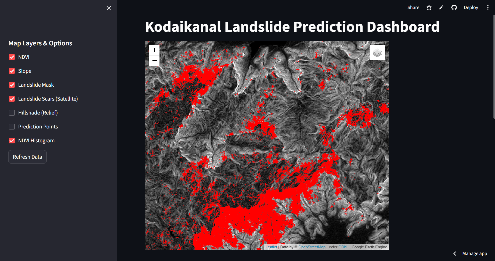
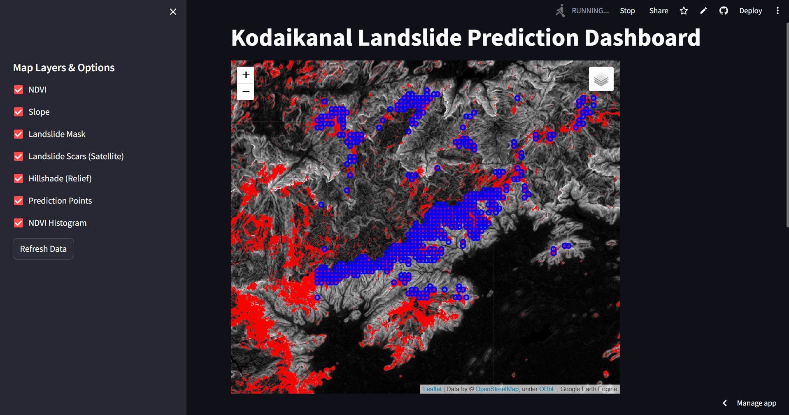
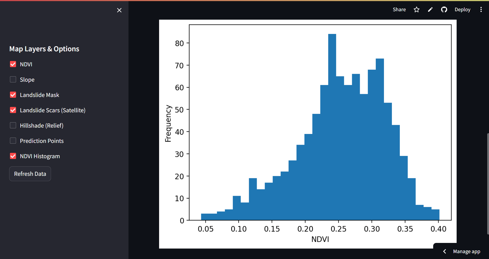

# Kodaikanal Landslide Prediction Dashboard

A Streamlit web app that visualizes landslide-prone terrain around Kodaikanal, Tamil Nadu using Google Earth Engine satellite data.

Live app: https://landslidedetection.streamlit.app/

## What this project actually does (today)

This is currently a **rule-based GIS / remote-sensing susceptibility map**, not a trained machine-learning model. It combines:

- **NDVI** (vegetation health) computed from Sentinel-2 optical imagery
- **Slope** derived from a digital elevation model
- **Hillshade / relief** for terrain context
- Threshold logic on NDVI + slope to flag likely landslide-prone pixels, shown as the "Landslide Mask" layer
- A Sentinel-1 SAR-based "Landslide Scars" overlay
- Sample "Prediction Points" for spot-checking specific locations
- An NDVI histogram summarizing vegetation distribution across the region

All layers can be toggled on/off from the sidebar, and data can be refreshed live from Earth Engine.

## Screenshots

**Landslide mask and scars over Kodaikanal**


**Terrain view with hillshade relief**


**Sample prediction points overlaid on terrain**


**NDVI distribution histogram**


## AI / ML roadmap

A U-Net deep learning model was trained on this same NDVI/slope/SAR data in a companion Colab notebook. However, the trained model weights were only ever saved to a temporary Colab session and were lost when that session disconnected, before being committed here. Retraining the model and committing the weights to this repo is a planned next step. Once that's done, the app will be updated to serve real ML-based predictions instead of the current threshold-based mask.

## Tech stack

- Streamlit
- Google Earth Engine Python API
- Folium / streamlit-folium
- Sentinel-1 (SAR) and Sentinel-2 (optical) imagery

## Running locally

```
pip install -r requirements.txt
streamlit run app.py
```

You'll need your own Google Earth Engine service account, with the credentials JSON set as an `EE_CREDENTIALS_JSON` secret (in Streamlit Cloud) or environment variable (locally).
